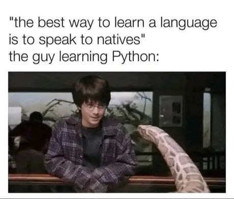

# NYC 031124 Phase 3

## How this works:

Included in this readme are links to each of the repositories we'll be using.

Before each lecture, navigate to the proper repository and run your normal fork / clone. There is no need to create a new branch unless instructed.

## Week One

### Day One

Morning:
Python Fundamentals & Debugging

Afternoon:
Python Data Structures

### Day Two

Morning:
Intro to Object Oriented Programming

### Day Three

Morning:
Object Oriented Programming Inheritance and Class Methods

### Day Four

Morning:
Intro to SQL

Afternoon:
SQL Relationships

### Day Five
Morning:
Object Relationships in Python

## Week Two

### Day One

Morning:
Week One Review

### Day Two

Morning:
Intro to ORMs

### Day Three

Morning:
Phase 3 Project Prep

### Day Four

### Day Five

Morning:
Work on Projects

Afternoon:
Work on Projects

## Week Three

### Day One

Morning:
Intro to SQLAlchemy

Afternoon:
Work on Projects

### Day Two

Morning:
Work on Projects

Afternoon:
Work on Projects

### Day Three

Morning:
Work on Projects

Afternoon:
Work on Projects

### Day Four

Morning:
Work on Projects

Afternoon:
Work on Projects

### Day Five

Morning:
Project Presentations

Afternoon:
Phase 4 Prep

## Memes Go Here

